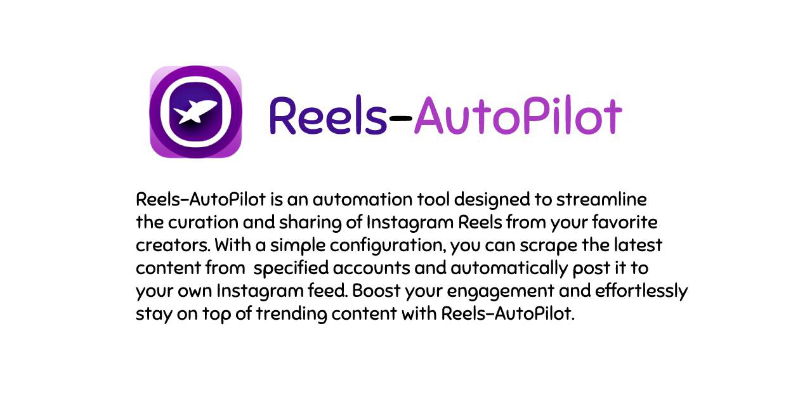

# Reels-AutoPilot

Reels-AutoPilot is a powerful GitHub repository that scrapes reels from specified Instagram accounts and automatically posts them to your account. Keep up with the latest content from your favorite creators and effortlessly share it with your followers. Enhance your Instagram presence and grow your account with Reels-AutoPilot!

## Getting Started

Before using Reels-AutoPilot, set your configuration variables in the `config.py` file.

### Prerequisites

- Python 3.x
- A valid Instagram account

### Installation

1. Clone the repository:

```
git clone https://github.com/avnsh1111/Instagram-Reels-Scraper-Auto-Poster.git
```

2. Install the required dependencies:

```
pip install -r requirements.txt
```

### Configuration

In `config.py`, set the following variables:

- `USERNAME`: Your Instagram username
- `PASSWORD`: Your Instagram password
- `ACCOUNTS`: An array of Instagram accounts to scrape reels from
- `FETCH_LIMIT`: Number of reels to fetch per account
- `HASHTAGS`: Hashtags to add while reposting reels
- `POSTING_INTERVAL_IN_MIN`: Interval in minutes between reel postings
- `SCRAPER_INTERVAL_IN_MIN`: Interval in minutes between scraper runs

Example:

```python
FETCH_LIMIT=10
USERNAME = "your_instagram_username"
PASSWORD = "your_instagram_password"

ACCOUNTS = [
    "account1",
    "account2",
    "account3"
]
HASHTAGS = "#reels #reelsinstagram #reelitfeelit"
POSTING_INTERVAL_IN_MIN = 15
SCRAPER_INTERVAL_IN_MIN = 720  # Every 12 hours
```

## Usage

### Scraping Reels

To scrape reels from the specified accounts in `config.py`, run:

```
py index.py
```

This will scrape reels and store them in the `downloads` folder.

### Posting Reels

To post scraped reels to your Instagram account, run:

```
py poster.py
```

This will post reels at the specified interval in `config.py`.

## Contributing

To contribute to this project, submit pull requests or open issues with your suggestions and ideas.

## License

Reels-AutoPilot is licensed under the GNU General Public License v3.0 - see the [LICENSE](LICENSE) file for details.

## Acknowledgements

- Thanks to all developers who contributed to the libraries used in this project.
